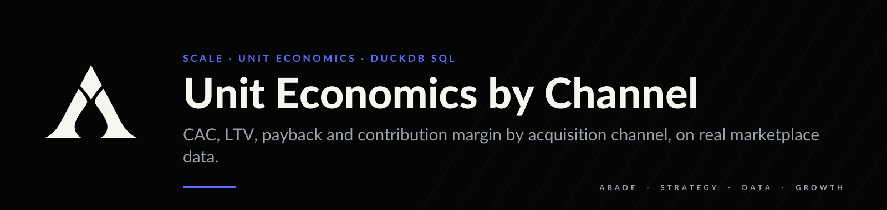
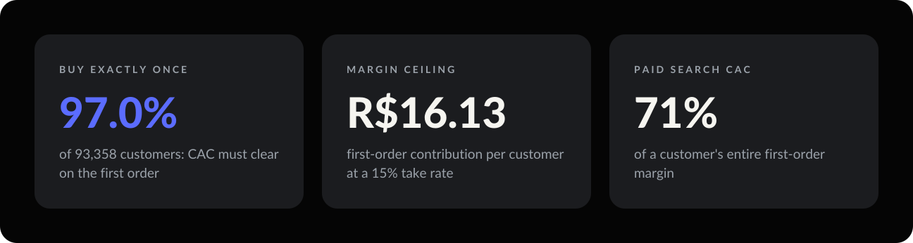
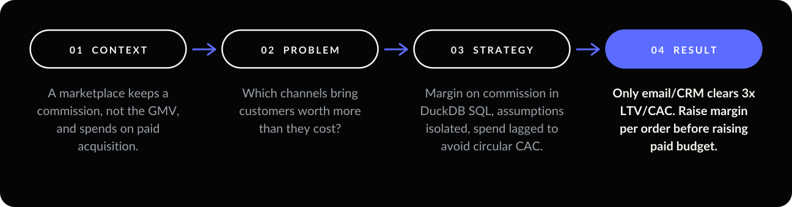
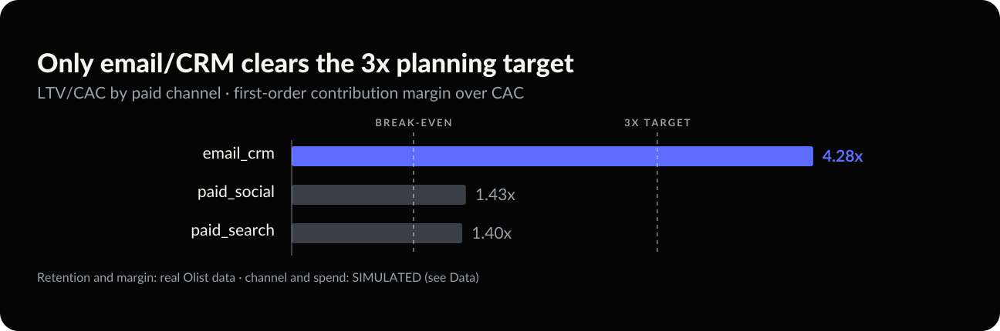

<p align="center"></p>

<p align="center">
  
  
  
  
</p>

**97% of customers buy exactly once, so acquisition has to pay for itself on the first order.** At a
15% take rate that first order leaves R$ 16.13 of margin, and paid search spends 71% of it to acquire
the customer.

<p align="center"></p>

<p align="center"></p>

---

## 01 — Context

A marketplace is spending on paid acquisition across several channels. It does not keep the value of
a sale: it keeps a **commission** on it. Unit economics built on GMV would overstate the business by
roughly the inverse of the take rate.

### Data

| | |
| --- | --- |
| Source | Olist Brazilian E-Commerce public dataset |
| Original home | [Kaggle](https://www.kaggle.com/datasets/olistbr/brazilian-ecommerce) (requires login) |
| Mirror used | [Hugging Face](https://huggingface.co/datasets/aviahYadler/Olist_Ecommerce_Dataset): identical files, no credentials needed |
| Size | 99,441 orders · 112,650 order items · 96,096 unique customers |
| Period | Orders from 2016-09 to 2018-08; analysis window 2017-02 to 2018-08 |

| Real (from Olist) | SIMULATED (generated by this project) |
| --- | --- |
| Orders, items, prices, freight, timestamps | Acquisition channel per customer |
| Customer identity and repeat purchase | Media spend per channel per month |
| Everything in the retention result | Everything in the channel-level CAC results |

**Olist publishes no acquisition channel and no media spend.** Channel membership is a deterministic
hash of `customer_unique_id`, and spend is a declared share of the previous month's net revenue. The
**retention and margin findings are evidence**. The **channel findings demonstrate the measurement
framework**. They are not a claim about Olist's real marketing.

`src/unit_economics/ingest.py` asserts every file's row count against the published figures, so a
truncated or swapped mirror fails loudly.

---

## 02 — Problem

The question is not *which channel brings the most customers* but *which channel brings customers
worth more than they cost*. That needs a margin model, not a revenue model.

---

## 03 — Strategy

| Decision | Why |
| --- | --- |
| **DuckDB SQL for transformations** | Joins and aggregations over ~112k rows, reviewable by an analyst who does not read Python, with no warehouse to stand up. |
| **Assumptions as session variables** | `take_rate` and cost rates are set with `SET VARIABLE` and read with `getvariable()`, so the `.sql` files stay parameterised. |
| **Margin on commission, not GMV** | Modelling a marketplace as a retailer is the most common way to get this wrong by an order of magnitude. |
| **Budget lags revenue by one month** | Sizing spend from acquired customers makes CAC constant by construction. A test pins the signature so spend can never depend on acquisitions. |
| **Launch months excluded** | 2016-09 and 2016-12 have one order each and produce CAC in the thousands. |

### Metrics

```
contribution_margin = gmv * take_rate          (commission earned)
                    - gmv * psp_fee_rate       (payment cost, on the full transaction)
                    - variable_support_cost * orders
CAC                 = channel_spend / new_customers_acquired
LTV                 = observed contribution margin per customer
CAC ceiling at Nx   = LTV / N
```

Every assumption lives in [`src/unit_economics/config.py`](src/unit_economics/config.py):

| Assumption | Value | Note |
| --- | --- | --- |
| Take rate | 15% | Not published by Olist. The most sensitive input in the model. |
| Payment processing | 2.5% of GMV | Charged on the full transaction. |
| Variable support cost | R$ 1.50 per order | Service, disputes, reverse logistics. |
| Marketing intensity | 25% of previous month's net revenue | Sets the simulated budget. |

---

## 04 — Result

<p align="center"></p>

**Out of 93,358 customers with a delivered order, only 3.00% ever place a second one.** There is no
second purchase to recover acquisition cost from, so the first-order margin is a hard ceiling:

| Target LTV/CAC | Maximum CAC the business can pay |
| --- | --- |
| 1.0 (break-even) | R$ 16.13 |
| 3.0 (common planning target) | R$ 5.38 |

| Channel | Paid | Customers | Margin / customer | CAC | LTV/CAC | CAC as share of first-order margin |
| --- | --- | --- | --- | --- | --- | --- |
| organic_search | no | 24,851 | R$ 16.08 | — | — | — |
| paid_search | yes | 20,450 | R$ 16.31 | R$ 11.65 | 1.40 | 71.4% |
| paid_social | yes | 16,515 | R$ 16.16 | R$ 11.26 | 1.43 | 69.7% |
| direct | no | 14,035 | R$ 16.24 | — | — | — |
| marketplace_referral | no | 9,166 | R$ 15.73 | — | — | — |
| email_crm | yes | 7,360 | R$ 16.03 | R$ 3.74 | **4.28** | 23.3% |

Unpaid channels show no CAC rather than a CAC of zero: the ratio is undefined. Reporting zero would
make organic the best channel in every table.

> **Decision.** Raise margin per order (take rate, basket size, cheaper service) before raising paid
> budget, and shift budget toward email/CRM. First, check whether CRM is acquiring new customers or
> taking credit for demand that already existed.

---

## 05 — Limits and next move

- **Channel and spend are simulated.** No conclusion about Olist's real channels follows. The
  framework is the deliverable.
- **The take rate is assumed, and the conclusion is sensitive to it.** Average GMV per customer is
  R$ 141.43:

  | Take rate | Break-even CAC | Paid channels that still clear it |
  | --- | --- | --- |
  | 20.0% | R$ 23.20 | paid_search, paid_social, email_crm |
  | 15.0% (used here) | R$ 16.13 | paid_search, paid_social, email_crm |
  | 12.5% | R$ 12.59 | paid_search, paid_social, email_crm |
  | 10.0% | R$ 9.06 | email_crm only |
  | 8.0% | R$ 6.23 | email_crm only |

  Below roughly 12%, paid search and paid social stop paying for themselves. Pin this number down
  before acting.
- **LTV is observed, not predicted.** Later cohorts are censored, which biases LTV down. Predicting
  the uncensored value is the job of [clv-cohort-prediction](https://github.com/arielabade/clv-cohort-prediction).
- **No incrementality.** CAC here is average cost, not incremental cost. See
  [marketing-mix-modeling](https://github.com/arielabade/marketing-mix-modeling) and
  [ab-testing-toolkit](https://github.com/arielabade/ab-testing-toolkit).
- **Next move:** a take-rate sensitivity run, and a cohort view of whether CAC rises *within*
  channels over time.

---

## Run it

```bash
git clone https://github.com/arielabade/unit-economics-olist
cd unit-economics-olist
python -m venv .venv && source .venv/bin/activate
pip install -e ".[dev]"

python -m unit_economics.ingest      # downloads ~45MB and verifies row counts
python -m unit_economics.pipeline    # builds the analysis, writes data/processed/
pytest                               # 23 tests
streamlit run app/streamlit_app.py   # dashboard
```

## Repository map

```
sql/        staging → customer economics → channel economics, in order
src/        ingest, simulated channels, pipeline, metric formulas, roll-up
tests/      formulas, simulation reproducibility, the anti-circularity guard
app/        Streamlit dashboard
notebooks/  exploration
data/       raw/ and processed/, both git-ignored
```

---

<p align="center"></p>

<p align="center">
  <a href="https://github.com/arielabade">Portfolio</a> &nbsp;·&nbsp;
  <a href="https://github.com/arielabade/clv-cohort-prediction">Next: predict what customers are worth →</a>
</p>
